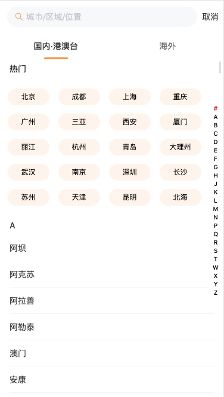
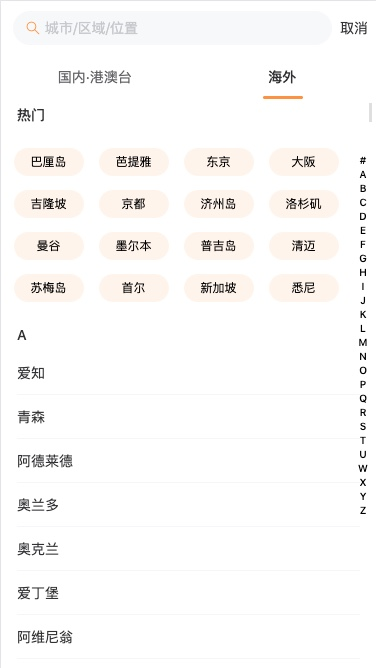
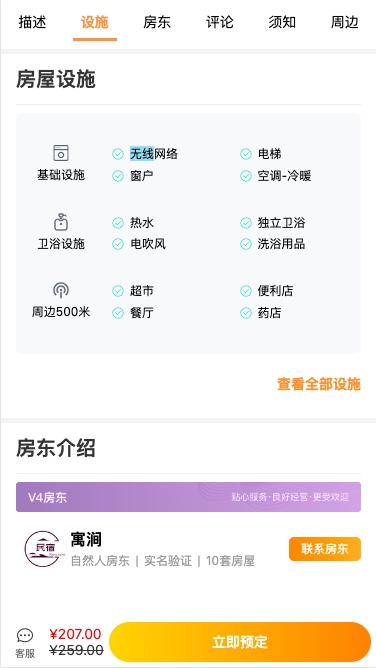
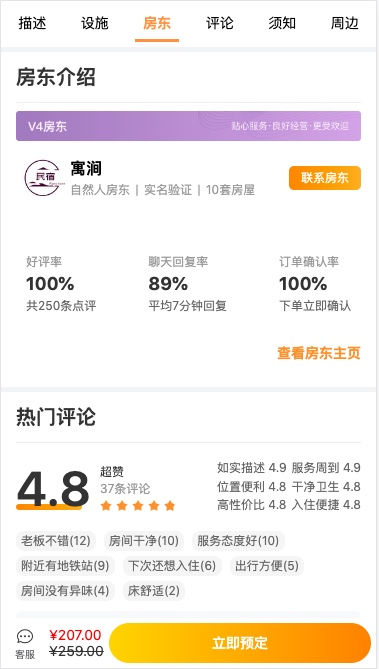
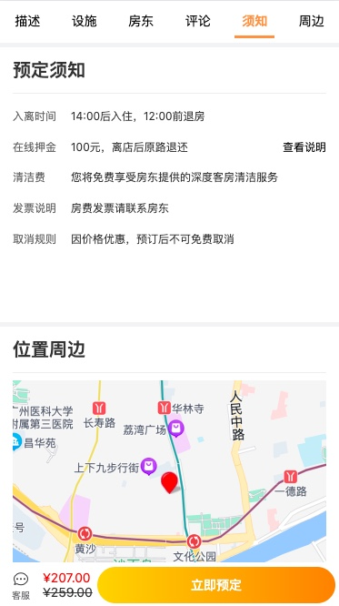
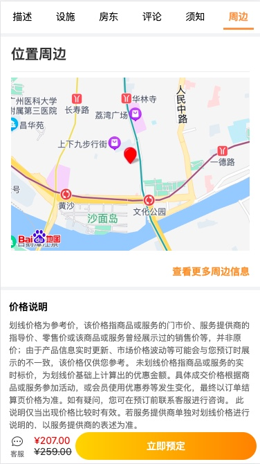

# **Vue3-H5-Trip**

## 简介

Vue3-H5-Trip 是基于 vue3 + vant3 + pinia + vite2 + axios + pnpm 等主流技术栈开发的 H5 旅途项目，使用 vue3 的 setup 特殊开发，适合作为一个熟悉 Vue3 的练手项目来学习参考。

## 特点

- 最新的技术栈： 使用 Vue3/vite2 等前端前沿技术开发
- setup 特性：使用 vue3 最新的 setup 特性开发
- 第三方库的封装：二次封装 axios 库，包括拦截器处理
- 组件：封装多个组件，包括插槽的使用（请求 Loading 组件、导航栏、搜索等等。。。）
- Hook 的封装： useSrcoll (用于处理页面的滚动监听等操作)
- pnpm： 使用最新的包管理工具

## 准备

- [node](http://nodejs.org/) 和 [git](https://git-scm.com/) -项目开发环境
- [Vite](https://vitejs.dev/) - 熟悉 vite 特性
- [Vue3](https://v3.vuejs.org/) - 熟悉 Vue 基础语法（setup 特性）
- [Es6+](http://es6.ruanyifeng.com/) - 熟悉 es6 基本语法
- [Pinia](https://pinia.web3doc.top/) - 状态管理的基本使用
- [Vue-Router](https://next.router.vuejs.org/) - 熟悉 vue-router 基本使用
- [Vant-UI](https://vant-ui.github.io/vant/#/zh-CN) 组件库基本使用

## 安装使用

- 获取项目代码

> git clone git@github.com:chenguox/vue3-h5-trip.git

- 安装依赖

> cd vue3-h5-trip
>
> pnpm install

- 运行

> pnpm run dev

- 打包

> pnpm run build

## 预览

- 暂未使用 jenkins 部署到服务器上
- 图片预览

